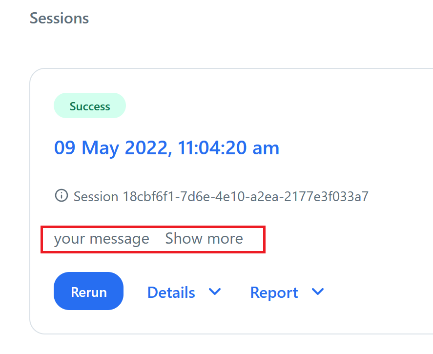

.. index::
    %notebook%: The session

The session
###########

When the user is interactively editing the code via 'open code' or executing it via 'run instance' a session is
generated providing the user with all the metadata for this specific session (e.g. inputs, outputs and parameters).
Once the session is initialised (see :ref:`pre_modules`), the user can retrieve the session's metadata via the following
methods.

*****************
Available aliases
*****************

In order to load (read) from the inputs or save (write) to the outputs inside a notebook, the user has to know the
aliases that have been specified for the different I/O in the UI. Instead of having to go back and forth between
Jupyterlab and the UI, the following code can be used:

.. code:: python

    session.io.inputs
    session.io.outputs
    session.io.parameters

Note that this is part of the default notebook that is generated when creating a new specification for the first time.
Also, note that if an input artifact does not contain any artifact version, an empty array will be returned.

*********************************
Modifying the status of a session
*********************************

During an instance run (during interactive mode, no session messages can be written), the user could write a message
that will appear onto the session card. A use case for example might be a message showing some 'pass/fail' for some
analyses executed inside the notebook. In this way, the user can immediately see the status of the instance run without
opening the html file.

The code to be used is the following:

.. code:: python

    session.manager.message("your message")

This message will appear on the session card as shown in the picture below. In case of longer messages, the user can
click on 'show more'.

*****************
Library verbosity
*****************

The level of verbosity can be changed by adding the following lines **before** the cell that instantiates the session.

.. code:: python

    import os
    os.environ["verbosity"] = "TRACE"

Following values can be provided: :code:`TRACE`, :code:`DEBUG`, :code:`INFO`, :code:`SUCCESS`,
:code:`WARNING` (default value), :code:`ERROR`, :code:`CRITICAL`.

.. _download_notebook:

************************************
Download data from within a notebook
************************************

It might happen that the user wants to download the contents of an artifact to the local machine. This can be done by
using the code snippet:

.. code:: python

    from yields_utils.io import download_pandas_csv
    from IPython.display import display

    for x in download_pandas_csv(df):
        display(x)

A download link will appear in the notebook.

**************************
Send metrics to Prometheus
**************************

It's possible to send custom metrics to prometheus via :code:`session.manager.metric`. Session id should be sent as a
label to track the source of the metric.

A prometheus metric is a numerical measurement that gets recorded as time series data. Specifically, it consists of:

- The measurement itself - a numeric value capturing something you want to track (like request count, memory usage,
response time, etc.).
- A timestamp - when the measurement was recorded.
- A metric name - identifies what's being measured.
- Labels (optional) - key-value pairs that add dimensions to the metric, allowing you to slice and filter the data in
different ways.

Prometheus metric primitives:

1. Counter - Always goes up (or resets to zero)

- Tracks cumulative totals: requests, errors, tasks completed.
- Query with rate() or increase() to see changes over time.

2. Gauge - Goes up and down freely

- Tracks current state: memory usage, CPU load, active connections.
- Represents a snapshot at measurement time.

3. Histogram - Groups observations into buckets

- Tracks distributions: request durations, response sizes.
- Provides buckets, sum, and count.
- Can calculate percentiles later with histogram_quantile().
- Aggregates across multiple instances.

4. Summary - Pre-calculates percentiles

- Similar to histogram but computes quantiles on the client side.
- More precise but cannot aggregate across instances.
- Use for single-instance monitoring only.

Quick decision guide:

Counting events? → Counter
Current value that fluctuates? → Gauge
Need distribution across multiple services? → Histogram
Need precise percentiles for one service? → Summary

For more information see prometheus documentation: https://prometheus.io/docs/introduction/overview/

:code:`session.manager.metric` is available for sending metrics to prometheus.

- :code:`metric`: Name of the metric you want to track (e.g., 'yfp_session_warning').
- :code:`primitive`: Type of metric - 'gauge' for values that go up and down, 'counter' for values that only increase.
- :code:`value`: The measurement value to record.
- :code:`docs`: Description of what this metric measures (optional but recommended).
- :code:`group_keys`: Categories to organize this metric by (optional). Useful for grouping related metrics together in
the monitoring dashboard
- :code:`kwargs`: Additional tags to label this metric, like session_id or instance_id. These help filter and analyze
metrics later.

.. code:: python

    session.manager.metric(
        metric="yfp_session_custom_metric",
        primitive="counter",
        value=123,
        docs="Custom session metric.",
        group_keys={"a": "b"},
        session_id=session.id,
        instance_id=session.instance.id,
        some_label="some label"
    )

Email notifications can be configured for alerts. Especially useful for exceptions:

:code:`session.manager.metric_exception` is available for sending exceptions to prometheus.

- :code:`exc`

.. code:: python

    try:
        uh = 1/0
    except Exception as e:
        session.manager.metric_exception(e)
