..
    label for referencing to this section

.. _artifact_procedures:

Artifact procedures
###################

In this part we explain on how the user can create artifacts himself.

.. index::
   %artifact%: How to register an artifact

.. _register_artifact:

********************
Register an artifact
********************

1. Access the "Artifact" menu page and click on the green "new" button (or in the centre of the page if no artifacts are present yet).

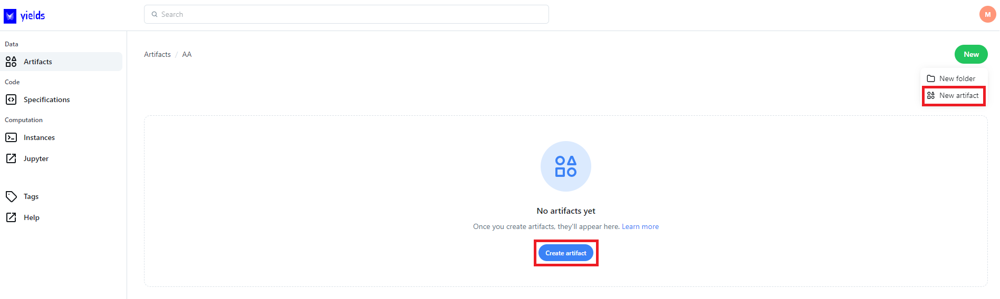

|

2. Fill out artifact details

    * Name - the name of the artifact is a free text mandatory field.
    * Description - the description of the artifact is a free text optional field.

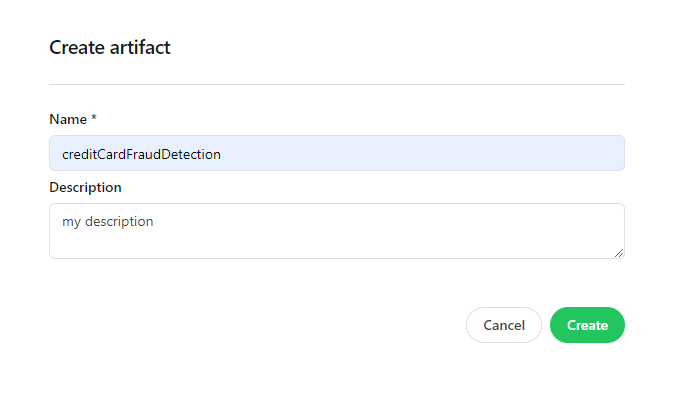

.. note::
    On the validation of uniqueness of artifact version names:

    * an artifact version that is a correction of a previous version can take the same name as this previous version it is correcting.
    * an artifact version can take the name of a version that has been deleted before.
    * in any other circumstance the uniqueness of artifact version name is validated.

|

4.Save the artifact by clicking on the "Create artifact" button

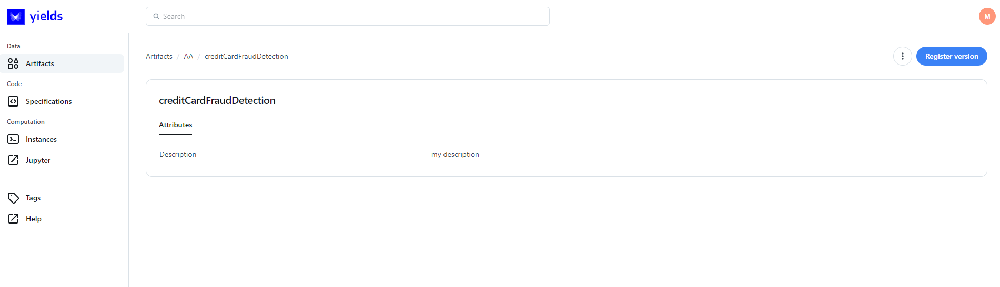

|

.. index::
   %artifact%: Upload files under an artifact

****************************
Register an artifact version
****************************

As mentioned in the definition of an :term:`Artifact`, the object itself is a container, which we created in the previous step.
In order to 'fill' this container with some content, we need to upload some files inside this container, which is what we call 'register version'.

1. Find the artifact of interest under the 'artifact menu' page and click 'Register version'.

.. figure:: figs/upload_artifact_01.png
    :width: 60%
    :align: center
    :alt: alternate text

|

Alternatively, click on the artifact's name, that brings you to a detailed page of the artifact. A similar register version button is to be found there.

.. figure:: figs/upload_artifact_1.png
    :width: 60%
    :align: center
    :alt: alternate text

|

2. To upload files from your local machine, click 'upload' and  "Choose files ...". Select and open the file that you want to upload. The artifact in which the user is creating a version is marked in green. The actual file being uploaded is underlined in red in the screenshot below.

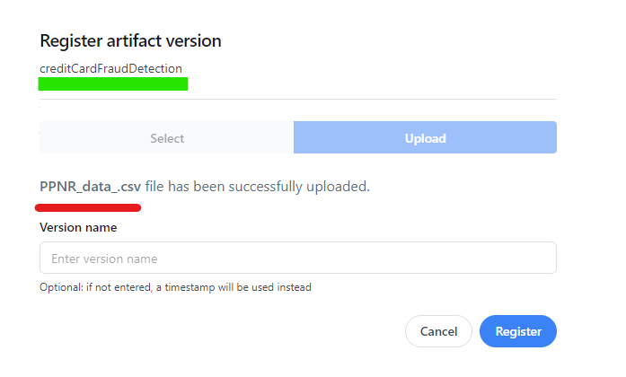

|

* in the platform default configuration the files that can be used to create an artifact version must have one of the following extension: csv, ipynb, parquet, sas7bdat, pdf, xml, xlsx, xls, json, h5, zip, pickle, excel. This can be adapted if necessary in the configuration.
* the artifact version that will be created after user clicks 'register' will have as default name the time of creation, but the user can choose its own name.
* for files that have already been uploaded once into the app, user can choose 'select' instead of 'upload'.

|

3. Once the user clicks 'Register', the resulting :term:`Artifact Version` can be checked, the object card having the artifact version UUID on it (and by which the artifact version can be filtered). Also, the number of registered versions shows above the artifact name in blue.

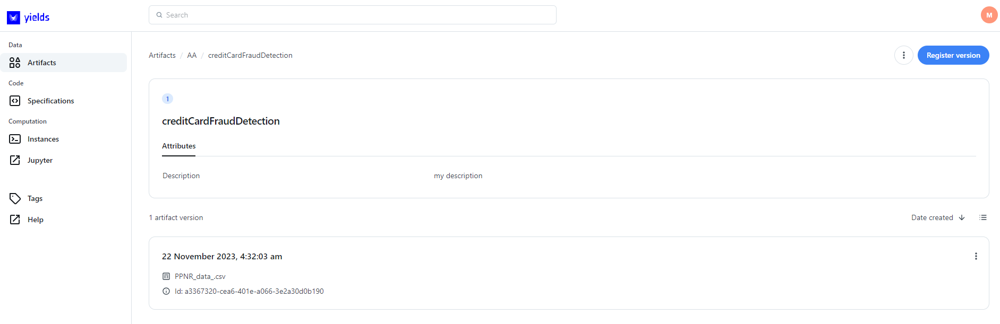

|

.. note::

    * Within a given version of an artifact, only a single file can be uploaded.

.. index::
   %artifact%: Correcting an existing artifact version

.. _Correcting an existing artifact version:

***************************************
Correcting an existing artifact version
***************************************

It might happen that the user, upon using the actual data from a given :term:`Artifact Version`, notices the data being uploaded was incorrect (e.g. due to wrong file selection, bad data, ...).
Therefore, during the uploading (step 2 in previous section), the user has the possibility to mark the new :term:`Artifact Version` to be a correction of a previous version by toggling the 'correction' button - see screenshot below. Upon ticking the box, the user can choose one out of all previous artifact versions belonging to the given artifact that should be corrected for.
In the example below, only one previous version has been registered.

.. figure:: figs/correct_2.png
    :width: 60%
    :align: center
    :alt: alternate text

|

The following happens if 'correction' is switched on:

* the :term:`Artifact Version` that will be corrected for needs to be selected (all previously created versions can be selected). After the upload, the correcting :term:`Artifact Version` will have the UUID of the corrected one. This 'correction attribute' is of importance to understand how our default mechanism of reading artifacts from code works - see :ref:`library_io`. Note that a given artifact version can only be corrected once.

* By default, any :term:`Tag`\(s) that is(are) associated to the corrected :term:`Artifact Version` will be associated to the correcting :term:`Artifact Version` as well.

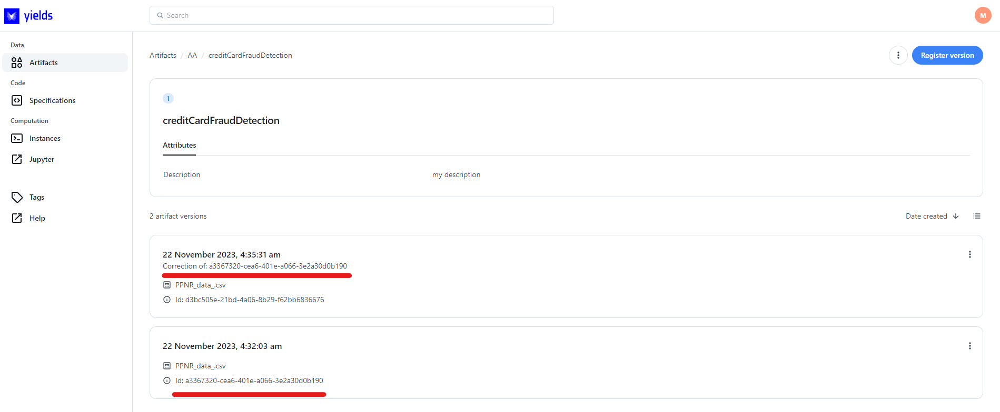

|

.. warning::
    We recommend not to dissociate any of the :term:`Tag`\(s) that are shown by default when creating a correcting :term:`Artifact Version` as it may lead to a bad read of the data - see :ref:`library_io` and :ref:`spec_notebook`.

|

.. _deletion_artifact_version:

***************************
Artifact (version) deletion
***************************

Deleting an artifact
====================

An artifact can be deleted by itself, meaning that the artifact object itself, as well as all versions - including the physical files - registered to this artifact are deleted. Also, any other (downstream) dependency of the artifact with respect to instances will be removed.

For example, let's take an instance that takes an artifact as input. The instance has 5 sessions.

.. figure:: figs/artifact_delete_1.png
    :width: 60%
    :align: center
    :alt: alternate text

|

Navigate to the artifact and choose 'delete' under the triple dots.

.. figure:: figs/artifact_delete_2.png
    :width: 60%
    :align: center
    :alt: alternate text

|

The dependencies of all instances and sessions that will be deleted are provided for information to the user, who can confirm the deletion.

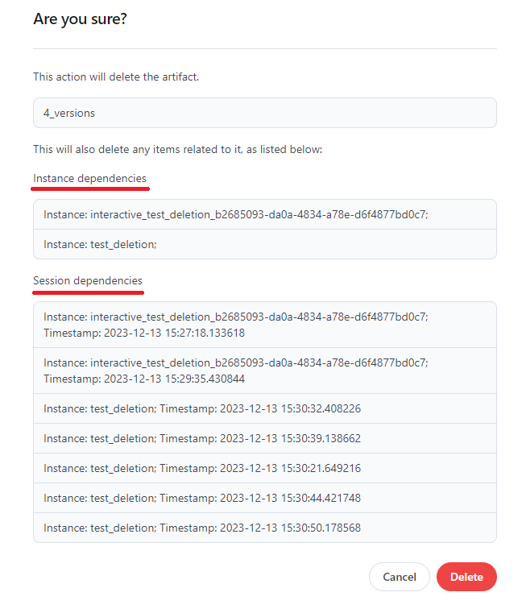

|

Because the deletion of the artifact itself impacts downstream deletion of instances, we also allow deletion for artifact versions only. In this way, users can manage their data (e.g. remove to increase storage, or to be GDPR compliant) without having to break existing dependencies.

Deleting a single artifact version
==================================

1. Navigate to the artifact *version* of interest in case you only want to delete this particular version.

.. figure:: figs/artifact_version_delete_1.png
    :width: 60%
    :align: center
    :alt: alternate text

|

2. A modal will show both the actual artifact version(s) to be deleted and eventual associated sessions to be marked as stale - see next section :ref:`general_deletion_rules`.

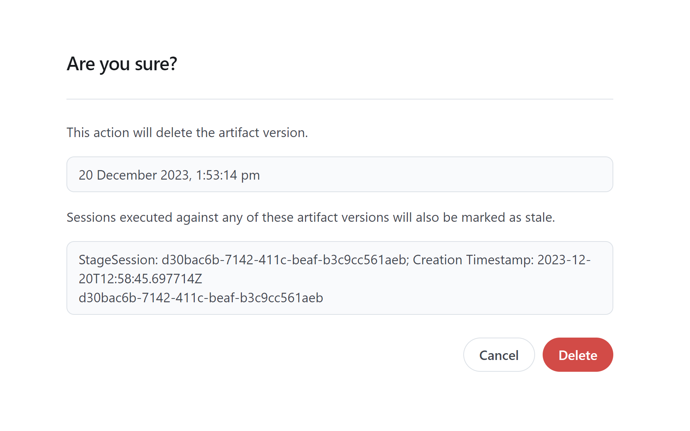

|

3. Find the artifact version deleted.

.. figure:: figs/artifact_version_delete_3.png
    :width: 60%
    :align: center
    :alt: alternate text

|

The consequence of having a version deleted is that cannot longer be selected as an input to a specification/instance.

Deleting multiple artifact versions in batch
============================================

Multiple artifact versions can be deleted at once. In order to do so, take the following steps:

1. Select 'delete versions' under the triple dots at the artifact level.

.. figure:: figs/artifact_version_delete_batch_1.png
    :width: 60%
    :align: center
    :alt: alternate text

|

2. Select a time window and click 'load' - this will return all artifact versions within the chosen window. By default, all versions between [today-10 days, today] are loaded, where today is the day user logged in into the app. In the example screenshot, the two versions checked will be deleted.

.. figure:: figs/artifact_version_delete_batch_2.png
    :width: 60%
    :align: center
    :alt: alternate text

|

3. Upon deletion, the user is asked for confirmation.

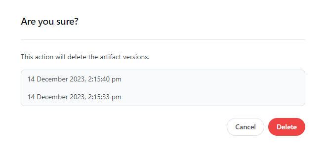

|

4. A progress bar is showing the status of the ongoing deletion.

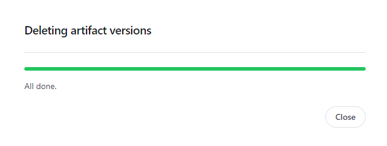

|

5. Finally, the 2 versions are deleted. By default all versions show, but the user can filter over either 'Present' as 'Deleted' state as well.

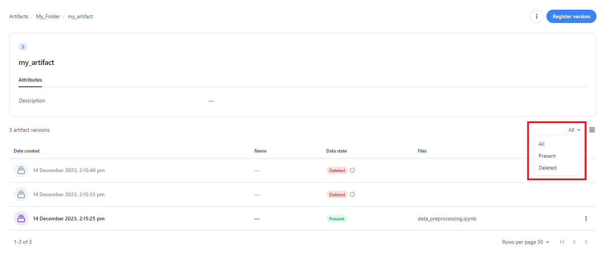

|

.. note::
    If an artifact version has tags associated, those tags will continue to be associated to the deleted version as well. The user can also search for deleted versions by tags.

|

.. _backend_cleanap:

Cleaning artifact versions in backend batch
============================================

Another way to cleanup artifact versions in batch mode exists. In this alternative approach, the artifact version(s) deletion is governed by some retention time rules that the end users may define in the frontend. This approach may help you enforce data retention policy in our application and stay compliant with various related regulations (GDPR, etc.).

In a nutshell, this approach works in 2 steps

* End users create artifact versions and can define a retention time for each of them
* In the backend, some job runs on a regular basis and deletes all artifact versions whose retention time has been reached

We will here explain the first step. The second one is for your application backend administrator to implement. The documentation of this second step is attached to our automation python module and can be sent upon request.

1. Create and register a new artifact version (called 'thirteen' in our below example). The default retention period at creation time is 'infinite' (i.e. keep artifact version forever)

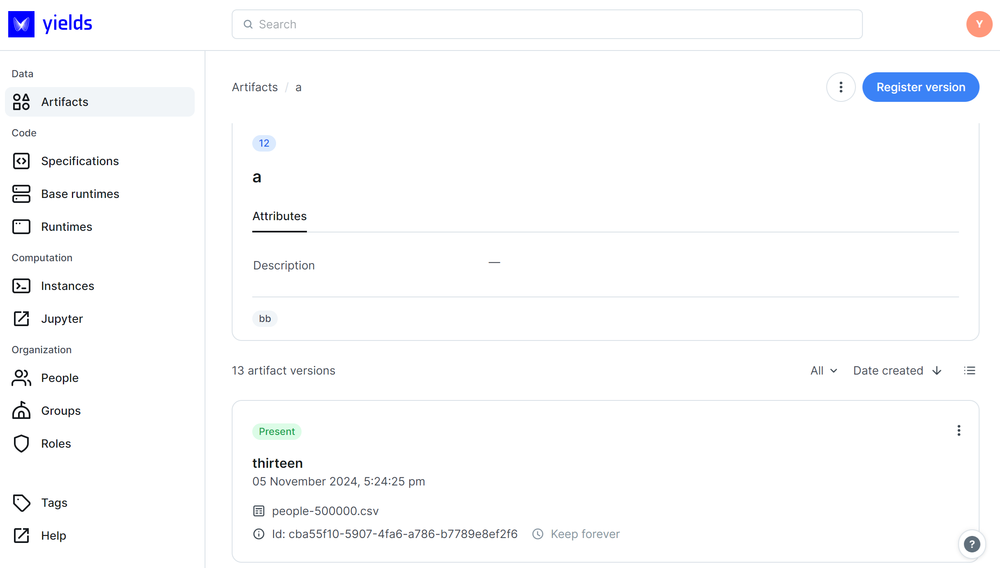

|

2. Edit the artifact details

.. figure:: figs/artifact_retention_2.png
    :width: 60%
    :align: center
    :alt: alternate text

|

3. Select your preferred retention period and save

.. figure:: figs/artifact_retention_3.png
    :width: 60%
    :align: center
    :alt: alternate text

.. figure:: figs/artifact_retention_4.png
    :width: 60%
    :align: center
    :alt: alternate text

|

4. Your artifact version now appears with the new retention period.

.. figure:: figs/artifact_retention_5.png
    :width: 60%
    :align: center
    :alt: alternate text

|

At this point and assuming the automated backend cleanup job is started, the artifact version will be deleted once we reach the retention period end, starting at the creation timestamp visible in UI on the artifact card.

Some deletion rules must be remembered here

* The automated cleanup job is secured by the Admin scope, i.e. the user and/or service running this job must be provided with a role that contains this scope
* Before performing the deletion we check that the artifact version that is to be deleted is not being used by running session (= session in 'Executing' or 'Pending' state that has input/output artifact the artifact that we are currently deleting)
* When it comes to deleting corrected versions of the artifact, the same cascade deletion will apply as explained in previous section
* If the artifact versions are reserved, they can only be deleted by one of the users they are reserved for

.. _general_deletion_rules:

General application rules for artifact version deletion
=======================================================

.. _cascade_delete:

Cascading deletion for corrections
^^^^^^^^^^^^^^^^^^^^^^^^^^^^^^^^^^

During registration of an artifact version, we allow to treat one version as correction for some previously registered version - see :ref:`Correcting an existing artifact version`.
If the artifact version to be deleted is a correction of an older version, this older version is deleted as well. The deletion in other words cascades down to all the *older* versions that have been corrected.
If multiple corrections have been done, the entire 'chain' will be deleted.

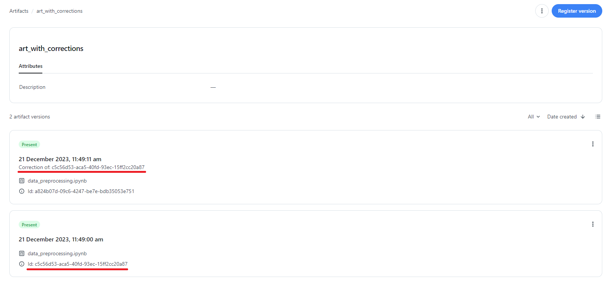

|

.. figure:: figs/cascade_delete_2.png
    :width: 60%
    :align: center
    :alt: alternate text

|

.. figure:: figs/cascade_delete_3.png
    :width: 60%
    :align: center
    :alt: alternate text

|

.. _robust_stale:

(Ir)reproducible sessions: robust vs stale
^^^^^^^^^^^^^^^^^^^^^^^^^^^^^^^^^^^^^^^^^^

**On metadata and actually loaded data**

The deletion of an artifact version could have a potential impact on the reproducibility of existing sessions.
Consider for example an artifact with only a single version and which is used as input to an instance. With input, we only mean the user chooses in the UI the version. A this point it's only metadata, as it doesn't say anything on how this version is actually used inside the notebook.
Now, imagine the following situations:

1. The code inside the notebook simply reads the file contained in the artifact version. It should be clear that e.g. deleting the artifact version immediately leads to irreproducible results, as the only file that is being read has been deleted.
2. The code inside the notebook does not use the artifact version at all (e.g. an empty notebook). It should be clear as well that deletion of the artifact version doesn't harm the actual computation at all. Meaning the results in this case are reproducible.

Bottom line is that **it's impossible for our application to control if and how the artifact version that is passed as an input (from UI) is actually used inside the code**. Therefore, we can only warn the user
that some session results *might* be irreproducible (we call such sessions '**stale**'), but it's up to the user to do the analysis to get a better grip.
On the other hand, there are situations in which we exactly know when sessions results are fully reproducible (we call such sessions '**robust**').

.. note::

    The rules below are based on the assumption that users *only* read artifact version, either as single version or 'read as append' as supported by our Python library, see :ref:`mode_single` and :ref:`mode_history`. The rules below for example don't hold if the user has implemented a 'forward read' or other customized read of artifact versions. We do however believe that an 'append read' covers the majority of the use cases.

**The rules are the following**:

* Deletion of an older artifact version impacts an append read that starts from newer versions down to this older version.

Therefore:

* Any *existing* session that uses an artifact version that was created *after or equal to* the creation date of the artifact version to be deleted will be considered 'stale', i.e. *possibly irreproducible*.
* Any *existing* session that uses an artifact version that was created *before* the creation date of the artifact version to be deleted will be considered 'robust', i.e. *certainly reproducible*.
* Any *new* session that will be created after a given artifact version is deleted will be 'robust'.

**Example without corrections**

Let's take as a starting point an artifact with 4 versions created, with v1 the oldest version and v4 created most recently (according to 'date created'). After the creation of these versions, 5 sessions have been generated,
each of which take other another version of the artifact as an input (at least, the metadata).

.. figure:: figs/Delete_Version_Stale_1.png
    :width: 60%
    :align: center
    :alt: alternate text

|

Following our assumption that users use our Python library to read as append, this means the following:

* v1 used: no append possible as no previous versions available;
* v2 used: append of v2 and v1;
* v3 used: append of v3, v2 and v1;
* v4 used: append of v4, v3, v2 and v1.

Now, let's go one-by-one over the different version that can be deleted:

* Delete v1:
    * off course, the session taking v1 *likely* cannot be reproduced (we cannot know, maybe v1 was not even used in the notebook): sessions s1 and s5 using v1 will be marked as stale.
    * If v1 is deleted, any append that starts from a version created after v1 can impossibly be reproduced. Therefore, any session that uses a version later than v1 will also be marked as stale.

    To summarize, deleting v1 marks all sessions as stale.

* Delete v2:
    * off course, the session taking v2 as input *likely* cannot be reproduced (we cannot know, maybe v2 was not even used in the notebook). S2 will be marked as stale.
    * If v2 is deleted, any append that starts from a version created after v2 can impossibly be reproduced. Therefore, any session that uses a version later than v2 will also be marked as stale.

    To summarize, deleting v2 marks sessions s2,s3 and s4 as stale.

* Delete v3:
    * off course, the session taking v3 as input *likely* cannot be reproduced (we cannot know, maybe v3 was not even used in the notebook). S3 will be marked as stale.
    * If v3 is deleted, any append that starts from a version created after v3 can impossibly be reproduced. Therefore, any session that uses a version later than v3 will also be marked as stale.

    To summarize, deleting v3 marks sessions s3 and s4 as stale.

* Delete v4:
    * off course, the session taking v4 as input *likely* cannot be reproduced (we cannot know, maybe v4 was not even used in the notebook). S4 will be marked as stale.
    * No more recent versions than v4 exist that could be impacted by an appended read.

    To summarize, deleting v4 marks session s4 as stale.

**Example with corrections**

Let's take as a starting point an artifact with 4 versions created, with v1 the oldest version and v4 created most recently (according to 'date created').
Also, *v2c (depicted in red) is a correction of v2*.

.. figure:: figs/Delete_Version_Correction_Stale_1.png
    :width: 60%
    :align: center
    :alt: alternate text

|

Now, let's go one-by-one over the different version that can be deleted:

* Delete v1:
    * off course, the session taking v1 *likely* cannot be reproduced (we cannot know, maybe v1 was not even used in the notebook): sessions s1 and s5 using v1 will be marked as stale.
    * If v1 is deleted, any append that starts from a version created after v1 can impossibly be reproduced. Therefore, any session that uses a version later than v1 will also be marked as stale.

    To summarize, deleting v1 marks all sessions as stale.

* Delete v2:
    * off course, the session taking v2 as input *likely* cannot be reproduced (we cannot know, maybe v2 was not even used in the notebook). S2 will be marked as stale.
    * If v2 is deleted, the user should understand well the way our Python library treats corrections in append read - see :ref:`mode_history`. In short, corrected version are *excluded* if our Python library is used. For our example, it means that neither the append starting from v2c, nor the append from v3 are impacted (because v2 is excluded in the append). This in turn meanss that sessions s3 and s4 are NOT impacted.

    To summarize, deleting v2 marks only session s2 as stale.

* Delete v2c:
    * off course, the session taking v2c as input *likely* cannot be reproduced (we cannot know, maybe v2c was not even used in the notebook). S3 will be marked as stale.
    * If v2c is deleted, any append that starts from a version created after v2c can impossibly be reproduced. Therefore, any session that uses a version later than v2c will also be marked as stale.
      But, also, due to the cascade deletion, v2 will be deleted, which in turn will be marking s2 (that uses v2) as stale.

    To summarize, deleting v2c marks sessions s2, s3 and s4 as stale.

* Delete v4:
    * off course, the session taking v4 as input *likely* cannot be reproduced (we cannot know, maybe v4 was not even used in the notebook). S4 will be marked as stale.
    * No more recent versions than v4 exist that could be impacted by an appended read.

    To summarize, deleting v4 marks session s4 as stale.

Input vs output artifact versions
^^^^^^^^^^^^^^^^^^^^^^^^^^^^^^^^^

When an artifact version is used as an input to an instance, the way the deletion impacts existing sessions is described above.
However, users can also delete artifact versions that are output from a session.

* If the artifact version is only output (no input to downstream instance), no impact on other sessions exist. The artifact versions can simply be deleted, while the session that generated the artifact version will remain present. Reason for this is that deleted artifact versions remain visible to some extent in the UI for traceability, but if we were to remove the session it could be considered a loose end. The deleted artifact version can be reproduced by rerunning the session (if no upstream artifact version deletion happened that impacts the reproducibility).
* If the output artifact version is in turn used as input to a downstream instance, the usual rules as described above hold.

.. _download_artifact_version_file:

*********************************
Downloading the files from the UI
*********************************

The file inside a given artifact version (either uploaded from UI or saved by a session run) can be downloaded to the user's local machine by clicking on the file link inside the artifact version card.

Downloading is possible only when the file is saved on the local filesystem AND Spark has not been used.

Downloading is NOT supported in the following situations:

* files saved on HDFS (either using Spark or not)
* files saved on the local filesystem using Spark.

.. index::
   %artifact%: Artifact other properties and methods

*************************************
Other artifact properties and methods
*************************************

Many other things can be done to the artifact object, similar to what is described in the :ref:`other_objects_methods` section.

1. Access the "Artifact" menu page
2. Either do one of the following:

    * Find the artifact you want to edit and click on the three vertical dots.

      .. figure:: figs/artifact_other_2.png
        :width: 50%
        :align: center
        :alt: alternate text

|

    * Click on the artifact itself and find on the top right-hand side the same options, but now in a pictorial way.

      .. figure:: figs/artifact_other_1.png
        :width: 50%
        :align: center
        :alt: alternate text

Things that can be performed:

    * changing an artifact's name.
    * viewing the :term:`Graph` to inspect the artifact's relationship with other :term:`Application objects` - see :ref:`graph_view`.
    * sharing an artifact with other users - see :ref:`sharing_an_object`.
    * checking the artifact's audit trail - see :ref:`viewing_audit_trail`.
    * moving an artifact - see :ref:`organizing_objects`.
    * managing tags on an artifact - see :ref:`tag_procedure`.
    * sorting artifact (versions) - see :ref:`sorting_attributes`.
    * reserving an artifact - see :ref:`reserve_object`.
    * downloading the uploaded file - see :ref:`download_artifact_version_file`.
