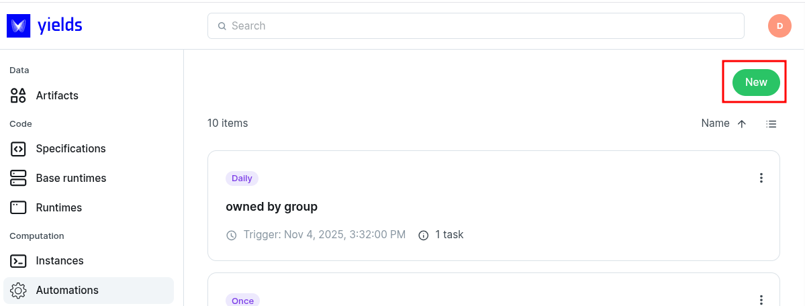
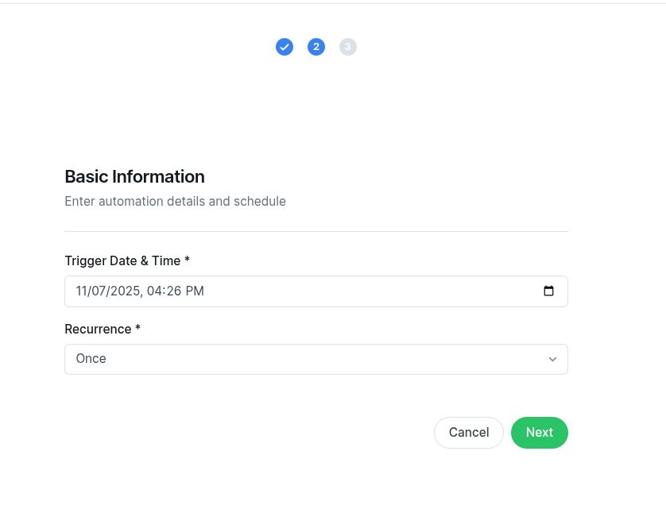
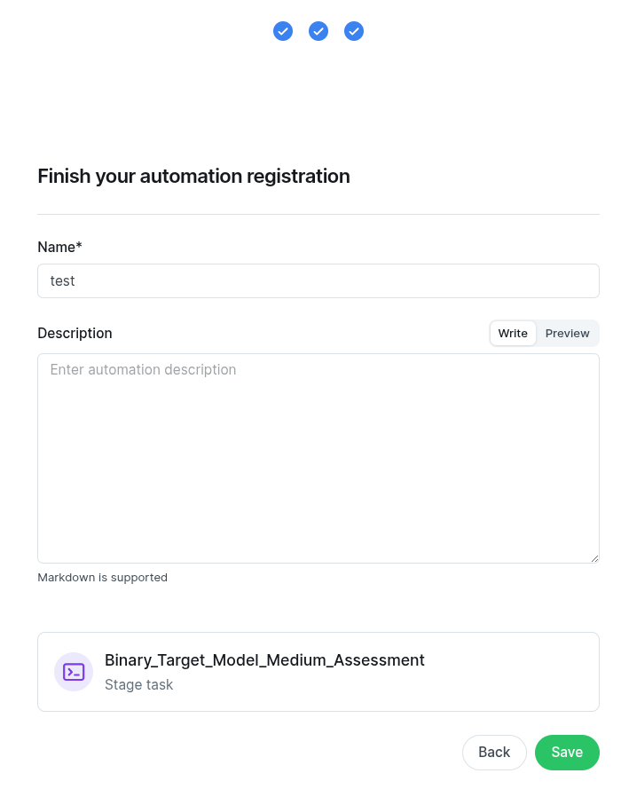

..
    label for referencing to this section

.. index::
   %Automations%: Automation procedure

.. _automation_procedure:

Automation procedures
#####################

The user can create an :term:`Automation` that executes an instance at a set time or with a recurrence.

**********************************
Creating an :term:`Automation` from within the menu
**********************************

1. Access the Automations menu and click on 'new'.

|

2. Search and select an instance you would like to run

.. figure:: figs/automation_create_select_instance.png
    :width: 80%
    :align: center
    :alt: alternate text

|

3. Set a time of the day and a recurrence.

|

4. Automation should have a name and a description.

|

You are then taken to the detail view for automation. Here is also where you see the history of the tasks.

.. figure:: figs/automation_detail_view.png
    :width: 80%
    :align: center
    :alt: alternate text

|

You can also see the definition of the task and you can navigate to the instance it is related to.

.. figure:: figs/automation_detail_view_task.png
    :width: 80%
    :align: center
    :alt: alternate text

|

The display is either a list or a card view. You can see the status of each task that was ran as well as the session that was generated by the task.
A task is successful if it starts and finishes. The task status does not depend on the status of the execution of the session.

.. figure:: figs/automation_detail_list_view.png
    :width: 80%
    :align: center
    :alt: alternate text

|

A task can be in failed state if the instance gets deleted and the task should run it.

.. figure:: figs/automation_fail_task.png
    :width: 80%
    :align: center
    :alt: alternate text

|

***********************
Create an automation from an instance
***********************
You can create an automation directly from an instance.

.. figure:: figs/automation_create_from_instance.png
    :width: 80%
    :align: center
    :alt: alternate text

|

***********************
Deleting a automation
***********************
To delete an automation you can use the burger menu.

.. figure:: figs/automation_delete.png
    :width: 80%
    :align: center
    :alt: alternate text

|

Then you need to confirm

.. figure:: figs/automation_delete_confirm.png
    :width: 80%
    :align: center
    :alt: alternate text

|
