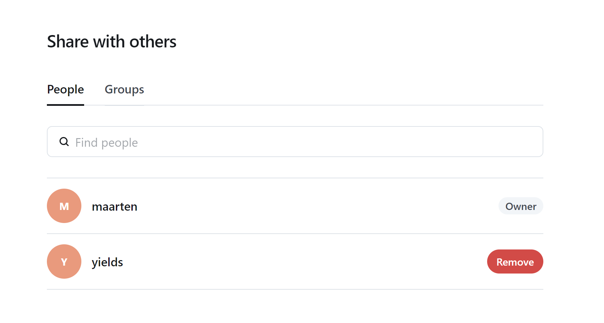
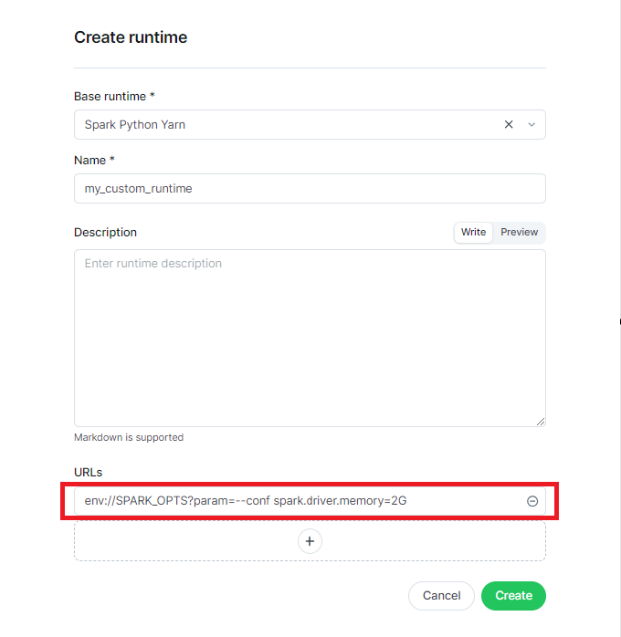

..
    label for referencing to this section

.. _other_objects_methods:

Other object-related procedures
###############################

In previous sections it has been explained how the different objects are created with a specific focus
on their particular nature (e.g. creating an :term:`Artifact` is different as compared to creating an :term:`Instance`).

Off course, many of these objects have similar methods that can be used of which:

* :ref:`viewing_audit_trail`
* :ref:`graph_view`
* :ref:`sharing_an_object`
* :ref:`copying_an_object`
* :ref:`organizing_objects`
* :ref:`sorting_attributes`
* :ref:`reserve_object`

.. _viewing_audit_trail:

*******************************
Viewing an object's audit trail
*******************************

Users can check an object's audit trail.
This audit trail contains the various events that applied to object and impacted it during its lifetime.

1. Either do one of the following:

    * Find the object you want to check the audit trail from and click on the three vertical dots.

      .. figure:: figs/instance_other_1.png
        :width: 50%
        :align: center
        :alt: alternate text

    * Click on the object itself and find on the top right-hand side the same options, but now in a pictorial way.

      .. figure:: figs/instance_other_2.png
        :width: 50%
        :align: center
        :alt: alternate text

3. Click on ‘Audit’ button where the ‘Details’ link shall enable you to see an event impact on the object.

    .. figure:: figs/audit_trail_1.png
        :width: 40%
        :align: center
        :alt: alternate text

.. index::
    %model%: Viewing a model's dependencies
    %spec%: Viewing a specification's dependencies
    %instance%: Viewing an instance's dependencies
    %artifact%: Viewing an artifact's dependencies

.. _graph_view:

********************************
Viewing an object's dependencies
********************************

Users can check an object's dependencies in a :term:`Graph` view by following the steps below:

Either do one of the following:

    * Find the object you want to check the dependencies from and click on the three vertical dots.

      .. figure:: figs/instance_other_1.png
        :width: 50%
        :align: center
        :alt: alternate text

    * Click on the object itself and find on the top right-hand side the same options, but now in a pictorial way.

      .. figure:: figs/instance_other_2.png
        :width: 50%
        :align: center
        :alt: alternate text

3 Click on the "View graph" option.

A new screen pop up with the first level dependencies displayed:

    * the area of the circle of the main object is twice as large as that of dependencies
    * the circle is fully colored when all object's dependencies are displayed
    * the circle is not completely colored when an object's dependencies are not explored
    * the arrow direction indicates the relationship (input, output) between two objects

    .. figure:: figs/model_graph_3.png
        :width: 80%
        :align: center
        :alt: alternate text

|

The user can further perform the following actions:

    * Explore next-level dependencies by clicking on the nodes

    .. figure:: figs/model_graph_4.png
        :width: 80%
        :align: center
        :alt: alternate text

|

    * Access object details by selecting it

    .. figure:: figs/model_graph_5.png
        :width: 80%
        :align: center
        :alt: alternate text

|

    * The user can immediately go to the object of interest by clicking on the name of the node under the object details (red box in screenshot).

    .. figure:: figs/model_graph_55.png
        :width: 80%
        :align: center
        :alt: alternate text

|

    * Show/Hide object details, exporting the graph or resetting it.

    .. figure:: figs/model_graph_6.png
        :width: 80%
        :align: center
        :alt: alternate text

|

.. index::
    %spec%: How to copy a specification
    %instance%: How to copy an instance

.. _copying_an_object:

*****************
Copying an object
*****************

Users can copy any object by means of the following steps:

Either do one of the following:

    * Find the object you want to copy and click on the three vertical dots.

      .. figure:: figs/instance_other_1.png
        :width: 50%
        :align: center
        :alt: alternate text

|

    * Click on the object itself and find on the top right-hand side the same options, but now in a pictorial way.

      .. figure:: figs/instance_other_2.png
        :width: 50%
        :align: center
        :alt: alternate text

|

3. Click on the "Create a copy" option.

A new screen will pop-up where the user can adjust the values of the attributes and save the new object.

.. index::
    %spec%: How to share a specification
    %instance%: How to share an instance
    %artifact%: How to share an artifact

.. _sharing_an_object:

*****************
Sharing an object
*****************

By default, all of the folders/objects a user is working in/with are only accessible for this user. In this way
access by other - potentially unauthorized - users is prevented.

Off course, at any point in time, one may want to explicitly share an item or a folder with a person or a group, for example:

* to foster collaboration within/outside a given team;
* to allow some auditor (who we assume is also using Yields for Performance) to have access to the analyses one might have performed,
  without having to share them through other means (e.g. mail).

.. warning::
    If your business model requires the object sharing ability, please ask the platform administrator to enable it.

To share a given object, one does either of the following:

    * Find the object you want to share and click on the three vertical dots.

      .. figure:: figs/instance_other_1.png
        :width: 50%
        :align: center
        :alt: alternate text

    * Click on the object itself and find on the top right-hand side the same options, but now in a pictorial way.

      .. figure:: figs/instance_other_2.png
        :width: 50%
        :align: center
        :alt: alternate text

3. Select the person/group you want to share the current folder with and click on the ‘Add’ button.

.. figure:: figs/folder_share_2.png
    :width: 40%
    :align: center
    :alt: alternate text

The object shall now be visible to all listed persons/groups.

3. Unsharing may be performed with the same procedure by removing the person/group by clicking on the ‘Remove’ button.

By sharing an object you also share its dependencies. To see the dependencies the user should clock on ‘See how’ in the UI (see previous screenshot).

.. figure:: figs/folder_share_4.png
    :width: 40%
    :align: center
    :alt: alternate text

The 'sharing perimeter' is also shown in the figure below, where each object and corresponding sharing perimeter are depicted in the same colour. So,
for example:

* user wants to share an :term:`Instance` : all downstream and upstream dependencies are shared as well.

.. figure:: figs/sharing_perimeter.png
    :width: 70%
    :align: center
    :alt: alternate text

|

.. _deleting_object:

*********************
Deleting an object
*********************

Users can delete an object and all its related dependencies at once.
Moreover, any associated data in the backend (data-lake HDFS and/or registries) are deleted too.
In order to delete a model user has to perform either of the following steps:

* Find the object you want to delete and click on the three vertical dots.

      .. figure:: figs/instance_other_1.png
        :width: 50%
        :align: center
        :alt: alternate text

|

* Click on the object itself and find on the top right-hand side the same options, but now in a pictorial way.

      .. figure:: figs/instance_other_2.png
        :width: 50%
        :align: center
        :alt: alternate text

|

3. Click on "Delete" option.

A new screen will pop-up where the user can confirm or cancel deletion by clicking on the confirmation button
or close window button. All dependencies that are about to be deleted are listed in two sections:
Instance dependencies and Session dependencies.

If the user confirms the object's deletion, it will not be displayed anymore in the object's page.

.. _reserve_object:

*******************
Reserving an object
*******************

Imagine a situation in which user A (say a quant-user) creates a specification and shares this specification with user B (also a quant-user). At this point in time, user B can also edit this specification, change the code etc. (we assume quant-user has these scopes).
If now user A only wants user B to have some limited access to this object (e.g. to disallow code changes), user A can reserve the specification for himself.

In general, the reserved functionality allows a user to reserve an object, either for himself or for one of the group(s) he belongs to.
Upon reservation of an object:

* any user that does not belong to the group and with whom the object is shared, will only have a limited set of actions available for this reserved object, that override the authorized actions as determined by the scope. The actions that are reserved are set application wide in a configuration file.
* any member of the group (if reserved for group) can take all the actions on this object, according to the user's scope.

In order to reserve an object (in the example below, we show an artifact), take the following steps:

1. Go to the common actions found under the triple dots. Select 'Reserve' as indicated by a lock.

.. figure:: figs/object_reserve_1.png
    :width: 70%
    :align: center
    :alt: alternate text

2. Choose for whom you want to reserve the object:

* Either for the user himself: this implies that any other users only have access to a restricted set of actions on this particular object (as determined per the configuration file).
* Either for one of the groups the user belongs to. An object can be reserved only for one group at a time.

.. figure:: figs/object_reserve_2.png
    :width: 70%
    :align: center
    :alt: alternate text

|

The scopes (actions) that are still actionable for everyone after reservation can be inspected by clicking 'see more'. Note that only the actions which are NOT in the list below are allowed for after reservation.

.. figure:: figs/object_reserve_5.png
    :width: 70%
    :align: center
    :alt: alternate text

|

3. Upon reservation:

* the allowed actions are restricted for users with whom the object has been shared (in the example, M is a quant-user but only 'view graph' and 'audit trail' are allowed).
* it is clear that the object has been reserved as the object card shows a 'reserved' label (only for card view).
* the 'info' button provides information who reserved the object, for whom and when the reservation happened.

.. figure:: figs/object_reserve_7.png
    :width: 70%
    :align: center
    :alt: alternate text

|

.. figure:: figs/object_reserve_3.png
    :width: 70%
    :align: center
    :alt: alternate text

|

4. Unreserving can be done by either the user that originally reserved the object or by any of the group members for which the object has been reserved. Unreserving leads back to the original state of the object in which 'all' actions are available to the users, according to their role (and thus scope).
Now imagine a case in which an object has been shared with user B, and this user B reserves the object. Now, the object can be unshared automatically undoing the reservation this user did.

.. _spark_config:

*************************************************
Setting Spark configuration from a custom runtime
*************************************************

The Spark driver settings can be set from the UI by creating a custom runtime.
During this process, the user has to pass a URL.

|

In order to change the spark settings, the user can pass for example:

.. code:: console

    env://SPARK_OPTS?param=--conf spark.driver.memory=2G & param=--conf key=value & ...

where for each configuration parameter the user has to provide some 'key-value' pairs, i.e. which parameter to set to what value.
