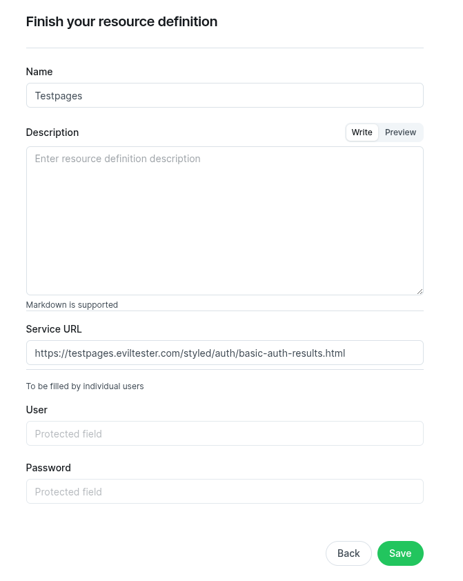
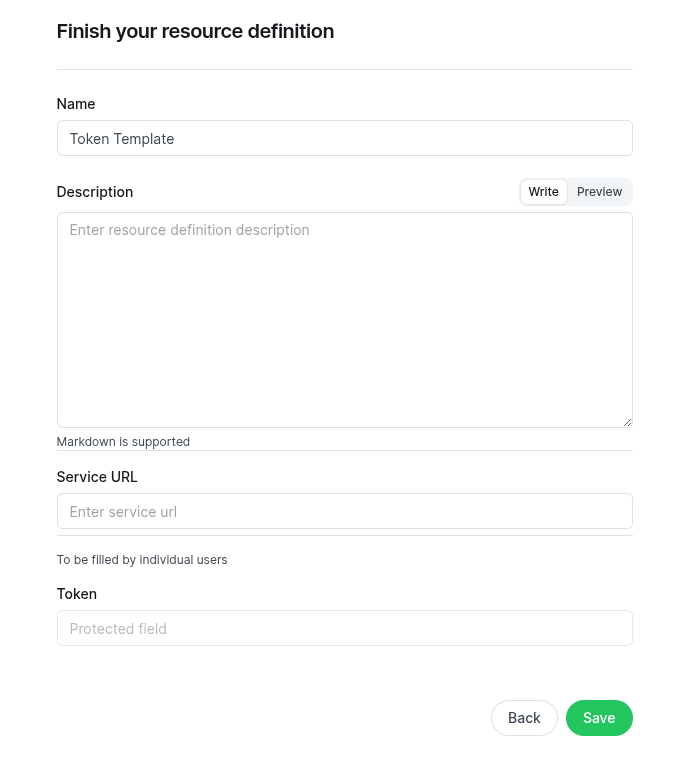
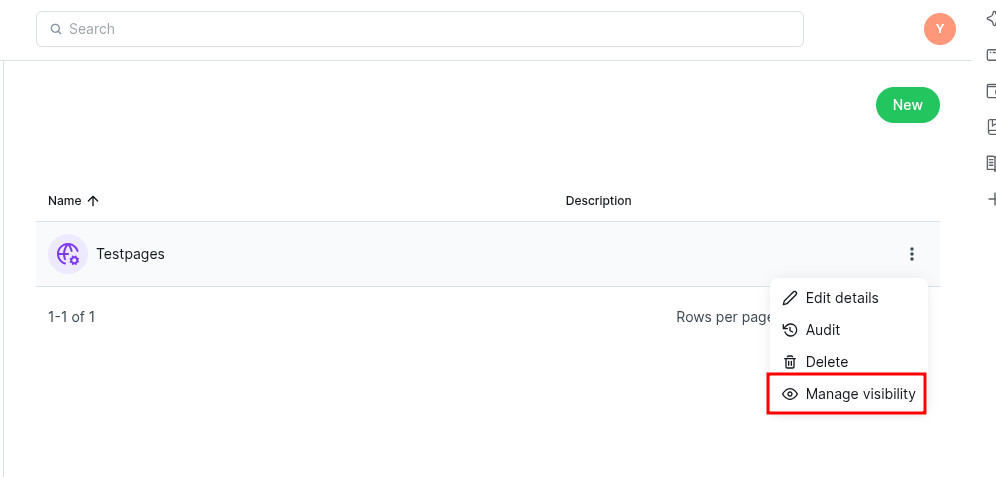
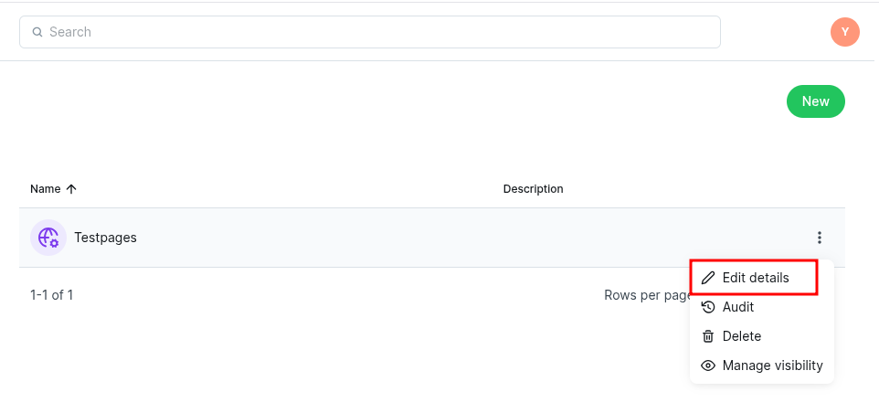
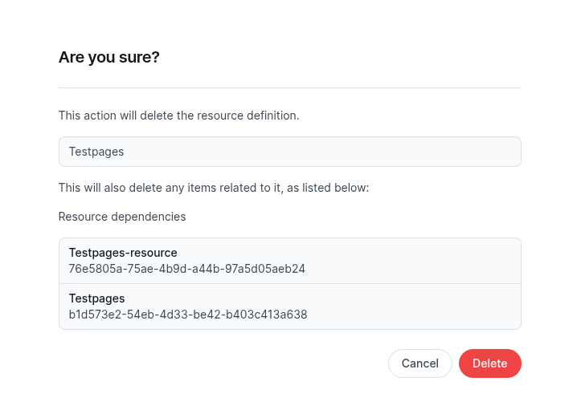

.. _resources_procedures:

Resources procedures
####################

Resources are used to store information like URLs and credentials for connecting to external services.

Creating a resource involves two steps:
    1. An admin creates a Resource Definition, which specifies the service location.
    2. The admin manages the visibility of the Resource Definition by allowing specific groups to use the Resource Definition.
    3. A user uses that definition to create a Resource, adding user-specific credentials.

.. index::
   %resource_definition%: How to create a resource definition

.. _create_resource_definition:

********************
Create a resource definition
********************

.. note:: Only users with admin role or correct scopes can access this functionality.

1. Open the "Resource definition" page. Click the green "new" button (or the center area if no definitions exist yet).

.. figure:: figs/resource_definition_start_create.png
    :width: 60%
    :align: center
    :alt: alternate text

|

2. Pick a template that fits your credential format.

Each template defines specific fields. Some include tokens, others require username/password.

.. figure:: figs/resource_definition_select_template.png
    :width: 70%
    :align: center
    :alt: alternate text

Information about fields:

        * Name – required text field.
        * Description – optional text field.
        * Other fields – filled based on the selected template.

.. note::
    Some fields can't be filled during creation; users will fill them later when using this definition.

.. note::
    URL shown is just an example.

*************
Default templates
**************

Default templates are User&Password Template and Token Template

    User & Password Template

.. figure:: figs/resource_definition_userpasstemplate.png
    :width: 60%
    :align: center
    :alt: alternate text

    Token Template

Templates are part of the application configuration and can be updated by applying a helm chart change.

|

3. Click "Save" to complete the creation.

.. figure:: figs/resource_definition_created.png
    :width: 60%
    :align: center
    :alt: alternate text

|

.. index::
   %resource_definition%: Manage visibility of a Resource definition

.. _manage_visibility_resource_definition:

********************
Manage visibility of a Resource definition
********************

After creating a :term:`Resource definition`, assign visibility to user groups.

.. note::
    Resource definitions can be shared only with groups, not individual users.

1. In the Resource definition menu, open the three-dot menu and select "Manage visibility".

|

2. Find the group and click "Add".

.. figure:: figs/resource_definition_manage_visibility_add.png
    :width: 60%
    :align: center
    :alt: alternate text

.. index::
   %resource_definition%: Edit a Resource definition

.. _edit_resource_definition:

********************
Edit a Resource definition
********************

You can edit a :term:`Resource definition` after creation.

.. note::
    Changes apply immediately and affect all code that is using the definition.

1. In the Resource definition menu, click the three dots on the desired row and select "Edit details".

2. Modify fields as needed and save.

.. figure:: figs/resource_definition_edit_finish.png
    :width: 60%
    :align: center
    :alt: alternate text

.. index::
   %resource_definition%: Delete a Resource definition

.. _delete_resource_definition:

********************
Delete a Resource definition
********************

Deleting a :term:`Resource definition` removes all linked :term:`Resource`.

1. Go to the Resource definition menu, click the three-dot menu, and choose "Delete".

.. figure:: figs/resource_definition_delete.png
    :width: 60%
    :align: center
    :alt: alternate tex

2. A confirmation shows all affected resources. Confirm deletion.

.. index::
   %resource%: Create a Resource

.. _create_resource:

***************
Create a resource
***************

Once a :term:`Resource definition` is available, users in the assigned group can create :term:`Resource`.

1. Open the "Resources" menu. Click the green "new" button (or the center area if no resources exist yet).

.. figure:: figs/resource_creation.png
    :width: 60%
    :align: center
    :alt: alternate text

2. Select the resource definition to use as a base.

.. figure:: figs/resource_create_selection.png
    :width: 60%
    :align: center
    :alt: alternate text

3. Complete the form. This includes the common fields from the definition and user-specific fields.

    * Name – required text field.
    * Description – optional text field.
    * Other fields – depend on the selected definition.

.. note:: Resource names must be unique per user.

.. figure:: figs/resource_creation_finish.png
    :width: 60%
    :align: center
    :alt: alternate text

.. index::
   %resource%: Edit a Resource

.. _edit_resource:

***************
Edit a resource
***************

Users can update credentials at any time. Previous values aren’t shown and must be re-entered.

1. Open the Resources menu. Use the three-dot menu on a resource and choose "Edit".

.. figure:: figs/resource_edit.png
    :width: 60%
    :align: center
    :alt: alternate text

2. Modify any required fields or leave unchanged ones blank. Click "Save".

.. figure:: figs/resource_edit_finish.png
    :width: 60%
    :align: center
    :alt: alternate text

.. index::
   %resource%: Delete a Resource

.. _delete_resource:

***************
Delete a resource
***************

1. In the Resources menu, find the resource and open the three-dot menu. Select "Delete".

.. figure:: figs/resource_delete.png
    :width: 60%
    :align: center
    :alt: alternate text

2. Confirm the deletion in the prompt.

.. figure:: figs/resource_delete_confirm.png
    :width: 60%
    :align: center
    :alt: alternate text

************
Using a resource in a notebook
************

Resources are accessed in notebooks via `session.remote`.

List all resources available to the user:

.. code:: python

    session.remote.resources

Select a specific resource:

.. code:: python

    res = session.remote.resource("example")

Access the name and description:

.. code:: python

    res.name
    res.description

List the resource fields:

.. code:: python

    res.fields

Use a field in code:

.. code:: python

    service.authenticate(user=res.field("User"), pass=res.field("Password"))

Full example using a resource named `Testpages` with fields:

* `Service URL`: https://testpages.eviltester.com/styled/auth/basic-auth-results.html
* `User`: authorized
* `Password`: password001

.. code:: python

    res = session.remote.resource("Testpages")

    res.fields

    import requests
    from requests.auth import HTTPBasicAuth
    response = requests.get(
        res.field("Service URL"),
        auth=HTTPBasicAuth(res.field('User'), res.field('Password'))
    )
    assert response.status_code == 200

.. figure:: figs/resource_utilization.png
    :width: 60%
    :align: center
    :alt: alternate text
