..
    label for referencing to this section

.. _specification_procedures:

Specification procedures
########################

To carry out quantitative analyses Yields for Performance uses Jupyter notebooks using the Python programming language.
In this context, creating a specification means that the user should define the inputs the notebook is taking, the output
it is creating, i.e. the so-called signature. Also the notebook itself is considered as part of the specification object.

.. index::
   %spec%: How to create a specification

.. _create_spec:

**********************
Create a specification
**********************

1. Defining a specification's signature
=======================================

There are two ways of creating a specification's I/O:

* Starting :ref:`spec_from_scratch`
* :ref:`spec_from_json`

.. _spec_from_scratch:

From scratch
^^^^^^^^^^^^

1. Click on the Specification menu item in the main left panel and click either the green new button or create a specification directly (only seen when no specifications exist yet on the page).

.. figure:: figs/create_spec_1.png
    :width: 50%
    :align: center
    :alt: alternate text

|

2. Select the input(s) your specification will be taking.

A first screen shows where the user has to click the '+' to add inputs.

.. figure:: figs/create_spec_40.png
    :width: 50%
    :align: center
    :alt: alternate text

Your specification can take any combination of objects the following input types
(Note that we do not assign specific values for them at this stage - see :ref:`spec_notebook`).

    * :term:`Parameter`
    * :term:`Artifact`

Now, the user should fill in the details of the selected input (The working example contains a single artifactd and a parameter - in green):

* Fill in the alias - in blue: this is the string to be used when you want to retrieve the object (artifact or parameter) from within the notebook).
* Fill in the description - in black: this description will be shown in the UI later on.
* For parameters (orange) the user has to choose a 'type' (string, double, integer or boolean) and provide a default value. This default value will be prefilled when creating instances during the next step but can be overwritten as well.
* There is also a possibility of adding more inputs (red circle). Then click 'next' to proceed.
* The user has the possibility to order the inputs according to wishes by using the arrows (in red). This ordering can only be done during this configuration stage (i.e. as long as we did not mark the specification as registered - see :ref:`spec_mark_as_registered`).
* Also, we offer a collapsed view of the inputs (the 'eye' icon in red). In case there should be many inputs, this might be more convenient.

.. figure:: figs/create_spec_4.png
    :width: 75%
    :align: center
    :alt: alternate text

|

3. Choose zero, one or more output artifacts.

Use the plus sign ( + ) to add more outputs if needed. The same remarks as for the inputs hold.

.. figure:: figs/create_spec_5.png
    :width: 50%
    :align: center
    :alt: alternate text

4. Name and describe the specification. Regarding the :term:`Runtime`, by default, the base runtime Spark Python YARN is prefilled.

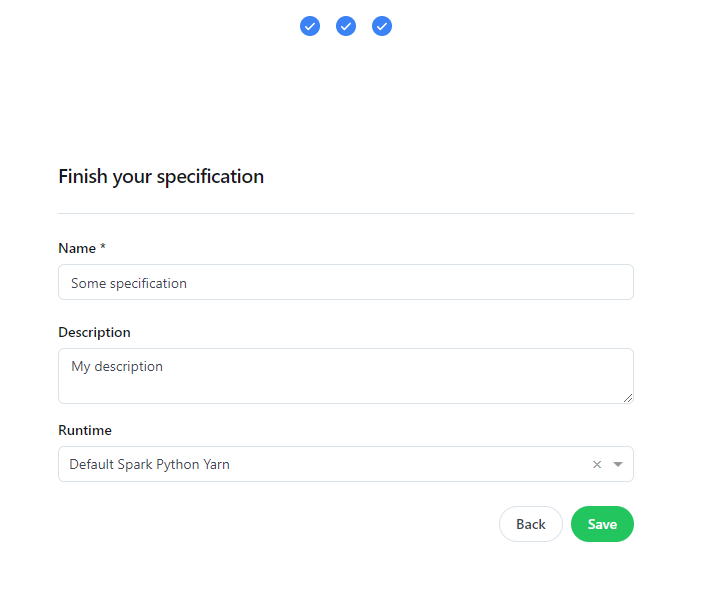

|

.. note::
   **Understanding the Runtime Choices**

   Use the following guidelines to select the appropriate kernel for your task:

   * **Default Spark Python Yarn:** Best for standard Spark jobs without custom library requirements. Spark versions are automatically managed and updated with the platform.
   * **Individual Spark Python Yarn:** Ideal for Spark jobs requiring custom Python libraries. Supports on-the-fly Python library installations.
   * **Python Kubernetes Container:** Recommended for non-Spark workloads. Comes pre-loaded with common Python libraries and allows for additional dynamic installations.
   * **Python Mini Kubernetes Container:** A "blank slate" lightweight environment. Use this when you need absolute control to install a specific set of libraries from scratch.

|

At this stage, only the I/O is defined and the specification is still in 'draft' (see :ref:`spec_mark_as_registered`). Next to this,
when clicking on the 'attributes' tab, the user is presented the relevant attributes - see screenshot below.

.. figure:: figs/create_spec_final_2.png
    :width: 80%
    :align: center
    :alt: alternate text

|

Also when clicking on the 'I/O' tab
an overview of the inputs and outputs the user defined is shown in the UI. The screenshot in the example shows a specification taking in two datasets
and outputting another dataset.

.. figure:: figs/create_spec_final.png
    :width: 80%
    :align: center
    :alt: alternate text

|

Off course, something should happen on the inputs, which is what the underlying notebook will do,
see :ref:`spec_notebook`.

.. _spec_from_json:

From a .json file
^^^^^^^^^^^^^^^^^

| When a specification is created - see :ref:`spec_from_scratch` - it can be exported/downloaded as a .json file (also see :ref:`spec_export_json`).
| This .json file on itself can be used in turn to create a new specification on itself.

The main benefits of having this functionality is:

    * in case a large number of inputs/output is used, one does not always want to define these from scratch because it's time consuming
    * in case only some minor modification to the original specification is needed (note that also copying an existing specification could help here)
    * most importantly, as a .json file is a widely used format, it enable easy sharing of the specification's signature outside the platform.

In order to create a specification from a .json file, the following steps should be taken:

1. Go to the specification menu item and click on the New button on the top right corner and choose 'Specification from json'.

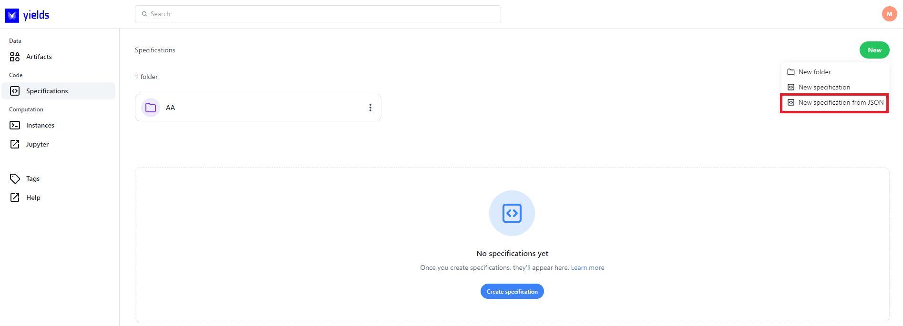

|

2. Click on 'Choose file' and browse towards the .json file of interest ('json_example.json' in the screenshot).

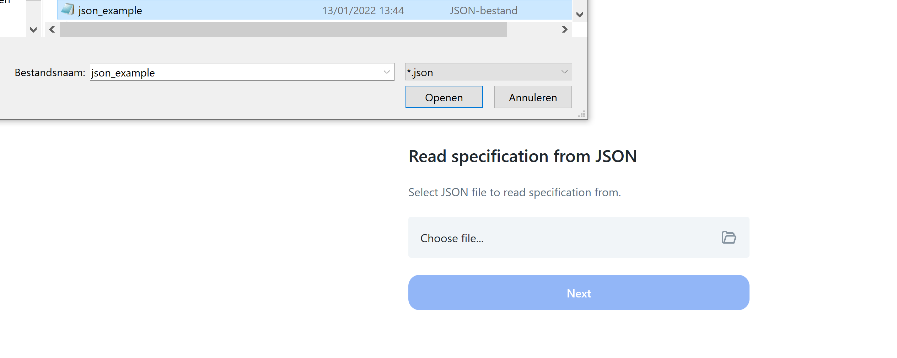

|

If a valid .json file is chosen, this is confirmed in the screenshot and click 'next'. The following screen that appears is the same as if you were
creating a specification from scratch, however, now the inputs, outputs, descriptions and all other parameters are already filled in.

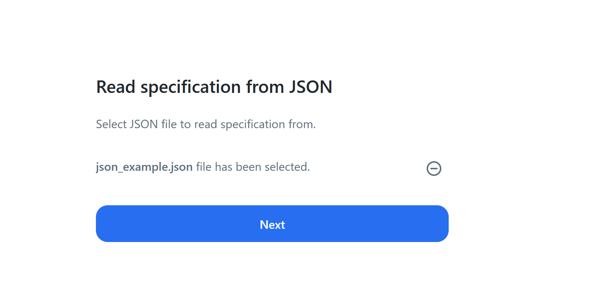

|

If an invalid .json file is chosen (e.g. because it's not a .json file at all, or it's content is corrupted in some sense) a warning is shown.

.. figure:: figs/create_spec_json_5.png
    :width: 50%
    :align: center
    :alt: alternate text

|

.. _spec_notebook:

2. Open a specification's notebook
==================================

Next to the I/O that determines the specification, the underlying notebook that will carry out the analyses,
should also be defined. To get access to and determine the underlying notebook there are two options (see green squares):

* Click on 'open code' on the specification card.

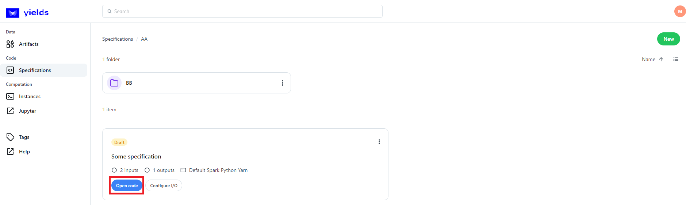

* Click on the specification name itself which takes you to the detailed page of the specification (e.g. here you can see the I/O, attributes etc.). On this page, you will also find the 'Open code' button.

.. figure:: figs/open_spec_1.png
    :width: 50%
    :align: center
    :alt: alternate text

By following either of the two previous options a menu shows where the user should give some **temporary** context to the abstract
I/O he defined until then.

.. figure:: figs/open_spec_23.png
    :width: 50%
    :align: center
    :alt: alternate text

.. note::
    At this stage the user needs to choose concrete inputs for the notebook to have something to work with.
    Note that these are NOT yet the final inputs on which the :term:`Instance` will run.
    In fact, we are here creating an 'interactive instance' - see :ref:`instance_procedures` for more information on creating an instance.

    To give a dummy example, if the final application of our notebook would be to calculate the average value of
    all numerical columns of a given dataset, the notebook itself would take the same form, whatever the specific dataset might be.
    It is, the specification notebooks are intended to serve as **generic templates** and therefore enabling a standardized approach in which the same code can be executed against many different inputs.

.. note::
    When opening code on a Draft specification, the specification will be :ref:`reserved <reserve_object>` automatically to your user. You can disable this by clicking on the checkbox.

The screenshots below shows a working example in which a single artifact is taken as input. A dropdown menu appears from which the user
can choose from any of the registered or temporary artifacts inside the platform.

* Select the artifact and the artifact version that the user might want to use inside the notebook. During the selection, the user is free to use either:

    * only the dropdown and scrolls to the version of interest.
    * fill in a custom string that should retrieve the matching artifact version (useful in case of many artifact versions). Attributes that are searched by are the artifact version id, name, correctionOf (uuid), sessionID (uuid) and creationTime. In case user wants to search by creationTime, it's currently mandatory to provide it as a string matching the backend format (e.g. type 03 for March).

* Next to choosing a particular :term:`Artifact Version` for every input artifact, we offer the possibility to read only certain :term:`Artifact Version`\(s) of the given input artifact versions as defined per tags.      The artifact version selected only serves the purpose of providing a pointer to the given version inside the notebook. The user can read any artifact version(s) he wants, we only provide the selected version as a handle. Next to this, our Python API covers two use cases:

    * reading only the chosen artifact version;
    * reading artifact version up till the chosen version, where the tags chosen are an additional filter - see :ref:`loading_artifacts`.
      Please read the API documentation carefully to understand the loading behaviour and the potential drawbacks using this mechanism - see :ref:`library_io`.

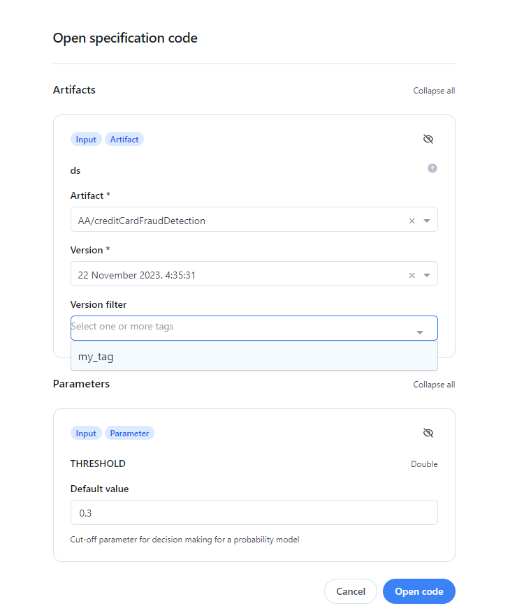

|

The user enters into Jupyterlab (if is the first time he enters, do 'sign in with Yields for Performance' and 'Launch server'). In Jupyterlab
the same attribute information as illustrated in :ref:`spec_from_scratch` can be found:

* green: the specification's name
* orange: the name of the notebook
* red: the runtime

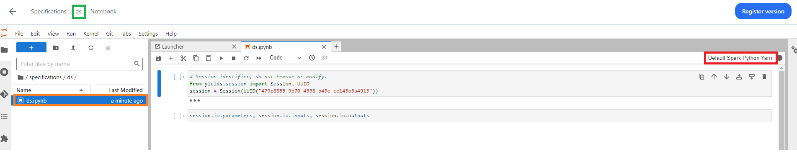

|

3. Changing a specification's notebook
======================================

Writing a notebook from scratch
^^^^^^^^^^^^^^^^^^^^^^^^^^^^^^^

Once the user enters into Jupyterlab he finds a standard Jupyter notebook in which he can do whatever he wants:

* change/add/delete code
* change/add/delete cells

Once the user is happy with the script's current state, **he must save it** (Ctrl-S).

.. note::
    The user is free to do whatever he/she wants in the Python notebooks. Off course, it should be mentioned that these notebooks
    'live inside' the application and that for example, in order to be able to read/write datasets from and to the platform we refer to the
    :ref:`library_io`.

Choosing an existing notebook
^^^^^^^^^^^^^^^^^^^^^^^^^^^^^^^^^

When the user has no notebooks at his disposal yet, he should start working onto the notebook content itself from scratch, see previous section.
However, as time evolves it might happen that the user has some 'notebook inventory' (e.g. somewhere offline) that he might want to use. In order to use these notebooks, do the following steps:

1. Inside Jupyterlab, choose the 'upload' file functionality highlighted in red.
2. Browse through your inventory for the notebook you would like to see appear.
   Note that the name of notebook should be identical to the one that is already present in Jupyterlab (and from which the name itself is automatically taken from the specification name).
   An 'overwrite file' question pops up: click 'yes'. The content of the notebook from your offline inventory will
   appear inside Jupyterlab, however with the name as determined by the specification.

   If the name of the uploaded Jupyter notebook is different from the one that is opened an error will be thrown. Reason for this is some underlying
   consistency checks with the (name of the) json file that is created at the time you push 'create specification'.

.. figure:: figs/offline_notebook_1.PNG
    :width: 50%
    :align: center
    :alt: alternate text

.. figure:: figs/offline_notebook_2.PNG
    :width: 50%
    :align: center
    :alt: alternate text

|

.. _run_spec:

*******************************************
Running a specification in interactive mode
*******************************************

When the Jupyter notebook has been opened inside Jupyterlab one can execute it against the chosen inputs
and finetune the content of the notebook according to wishes.

Note that even in interactive mode we allow the saving of artifacts, see the example in below screenshot.
Furthermore - those artifacts can in turn be used as inputs in some other specification as input for 'Open Code'. This enables
the possibility to build interactive end-to-end pipelines and hence a faster iteration between the different stages of this pipeline.

To retrieve the interactively saved object in the UI, one can use the 'name' attribute of the output object, see the screenshots below.

1. Inspect the name of the output object through the configuration.

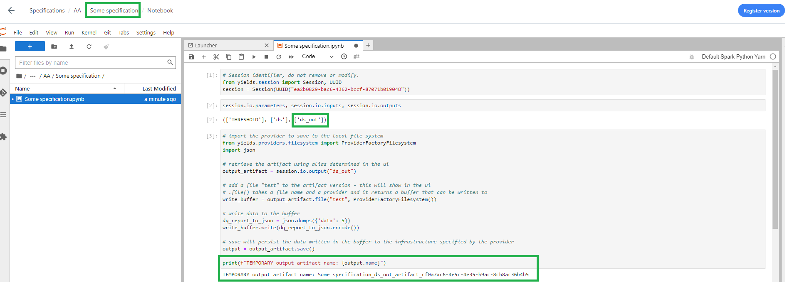

|

2. This interactively saved object will be available from the user-interface, where it's name as from the previous screenshot will appear.

.. figure:: figs/save_artifact_interactive_2.png
    :width: 70%
    :align: center
    :alt: alternate text

|

The following principles hold:

* a new object will be saved interactively (and thus appears in the UI) when at least one of the inputs of the specification that generates the object is changed (i.e. before you do 'open code').
* the interactively saved objects will be deleted whenever the entire platform is restarted, i.e. those are temporarily available. This is to be contrasted with the objects that are saved during a registered instance run. The latter are permanently stored inside the platform.

.. index::
   %spec%: Registering a specification's version

.. _spec_register:

****************
Register version
****************

When the user is satisfied with the notebook, he needs to save the notebook after which it can be registered as a version (not saving will simply register the latest saved version). The versioning implies the following:

* After registering it as a version, the notebook content shall be used when an instance is created from this notebook (see :ref:`instance_procedures`).
* When the notebook is only saved (but not registered) these changes are **not** taken into account when this specification shall be used to create an instance.
* A notebook can be 'version registered' under multiple versions, basically it's committing your code and ensuring it will be picked up by instances using this specification.

To register a version, click on 'register version' on top right hand side inside Jupyterlab.

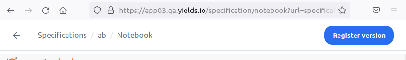

|

You can add any free comment to this version, which shall also be visible in the specification's attributes - see screenshots.

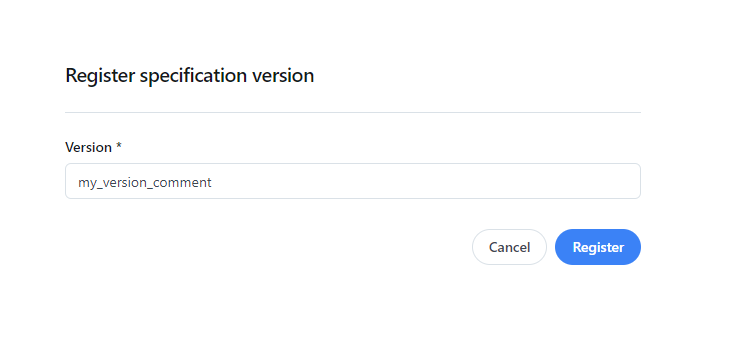

|

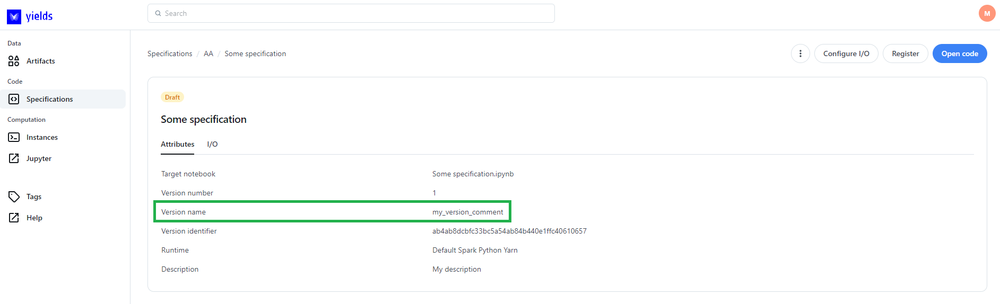

|

************************************
Change specification signature (I/O)
************************************

While a specification is in Draft we can change the structure of the inputs and outputs.
Press the 'Configure I/O' button, highlighted in red (also to be found on any specification in the listing page).

You will be presented with the previous structure of the specification which you can change
( add /remove inputs or outputs ), see :ref:`spec_from_scratch`.

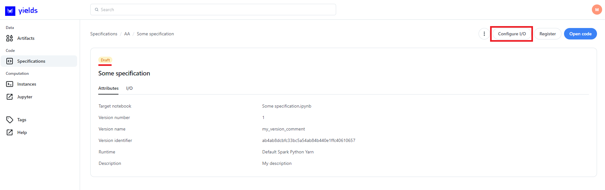

|

.. _spec_mark_as_registered:

******************
Mark as registered
******************

Once the user is happy with the state of the notebook and he does not intend to do any other changes,
the specification might get marked as registered. The actual meaning of this is
that 'the specification is ready to be used as a source/template for an instance'.

.. warning::
    * Registering a specification can only be done after the user went into Jupyterlab and committed the code ('register version').
    * once a specification is registered, the *signature* can no longer be changed (as it might impact downstream instances)!
    * only after a specification is marked as registered, it can be used to create an instance.

In order to mark a specification as registered, press the white 'Register' button on the top right-hand-side.

.. figure:: figs/mark_as_registered_1.png
    :width: 50%
    :align: center
    :alt: alternate text

|

After doing so, the specification says it's registered (red box). Secondary, other actions that can be taken on this specification are shown in the green box.

.. figure:: figs/mark_as_registered_2.png
    :width: 50%
    :align: center
    :alt: alternate text

|

.. note::
    Please note the subtle difference between :ref:`spec_register` and :ref:`spec_mark_as_registered`.

    * Register version: committing a current's state *notebook*. Can be done without 'marking as registered'.
    * Mark as registered: fixing the I/O *structure* of the specification. I/O *values* and content of the notebook can still be changed.

.. index::
   %spec%: Specification as .json file

.. _spec_export_json:

************************************
Export a specification as .json file
************************************

One of the key benefits of Yields for Performance is that it enables easy sharing of objects between different users. Therefore, often a .json
file is used as it can be easily interpreted and used also by other applications.

To export or download a specification, take the following steps:

1. Access the "Specification" menu page and find the specification of interest.
2. Click on 'export as JSON' - see previous screenshot. A .json file will be downloaded onto your local desktop.

.. index::
   %spec%: Other specification properties and methods

.. _spec_other_props:

*******************************************
Other specification properties and methods
*******************************************

Many other things can be done to the specification object, similar to what is described in the :ref:`other_objects_methods` section.

1. Access the "Specification" menu page.
2. Either do one of the following:

    * Find the specification you want to edit and click on the three vertical dots.

      .. figure:: figs/spec_other_1.png
        :width: 50%
        :align: center
        :alt: alternate text

    * Click on the name of the specification itself and find on the top right-hand side the same options, but now in a pictorial way.

      .. figure:: figs/spec_other_2.png
        :width: 50%
        :align: center
        :alt: alternate text

Things that can be performed:

    * viewing the :term:`Graph` to inspect the specification's relationship with other :term:`Application objects` - see :ref:`graph_view`.
    * sharing a specification with other users - see :ref:`sharing_an_object`.
    * copying a specification - see :ref:`copying_an_object`.
    * checking the specification's audit trail - see :ref:`viewing_audit_trail`.
    * deleting a specification - see :ref:`deleting_object`.
    * moving a specification - see :ref:`organizing_objects`.
    * reserving a specification - :ref:`reserve_object`.

.. _development_workflow:

Development Workflow for Specifications
######################################

There are two users involved in the development process:

* **John** — the owner and maintainer of the source specification. He has full access and editing rights.
* **Amy** — a developer who does not have access to the source specification directly. She works on *development copies* derived from it.

.. index::
   %spec%: Development Workflow

.. _create_dev_copy:

**************************
1. Create a Development Copy
**************************

Since Amy cannot edit the source specification (as it is :ref:`reserved <reserve_object>` for John),
she starts by creating a **development copy** of John's specification.

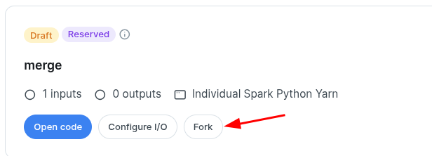

The development copy is a **clone** of the original source specification.
The system automatically names it following the pattern:

::

    <original_name>_<5 chars>_<number>

For example:

::

    risk_model_5f42g_1

Amy can rename this cloned specification at any later time.

.. note::
   The development copy includes the same inputs, outputs, and notebook as the source specification.

|

.. _open_dev_notebook:

*****************************
2. Open the Development Specification
*****************************

Amy opens the code for her cloned specification, which launches **JupyterLab**.

The notebook associated with the cloned specification opens automatically. It has the same name as the original since Amy is working on a **git fork** of the source repository.

A dedicated **branch** is automatically created and checked out. Its name matches the cloned specification, e.g.:

::

    risk_model_5f42g_1

|

.. note::
   This isolation ensures that Amy’s work remains independent of the source specification. She may create additional branches if required, but this is optional.

|

.. _implement_changes:

***********************
3. Implement Code Changes
***********************

Amy performs her development inside her dedicated branch. She can:

* Modify code cells.
* Add or remove notebook cells.
* Commit her progress regularly.

Each commit represents a **logical change** in the notebook’s evolution.

She may iterate multiple times until the notebook behaves as expected.

|

.. _prepare_review:

*******************
4. Prepare for Review
*******************

When Amy is satisfied with her updates, she prepares her work for review.

The following steps must be followed:

1. **Pull** the latest changes from the master branch of the source specification.
   The default merge strategy is *rebase*, so her branch’s commits are replayed on top of master.
2. **Merge** these changes into her working branch.
3. **Resolve conflicts** if any occur.
4. **Validate** that the notebook executes correctly after the merge.
5. **Push** her branch to the remote repository.

|

.. warning::
   While performing *Git actions* (Pull, Push, Refresh), do **not** keep the notebook open in JupyterLab.
   The notebook may be temporarily modified during these operations, which can cause inconsistencies.

|

.. _review_merge:

*************************
5. Review and Merge by John
*************************

Once Amy has pushed her branch, she notifies John.

John accesses the source specification and checks out the **branch pushed by Amy**.
He performs the following:

* Reviews code and validates it against project standards.
* If approved, merges Amy’s branch into the **master branch** of the source specification.
* Registers a new version of the specification, making it the latest official version.

|

.. note::
   Registering creates a new version of the notebook within the platform.
   See also: :ref:`spec_register`.

|
.. _dev_behaviour:

*****************
Behavioural Notes
*****************

**Automatic Naming**

* Development copies automatically receive a `_5chars_` suffix and an incremented number.
* They can be renamed at any time.

**Notebook Duplication**

* Cloned specifications include the same notebook name as the source.
* This consistency comes from the git fork structure of the repository.

**Branching Strategy**

* Each forked specification creates a **dedicated branch**.
* Only forked specifications show the **Pull** and **Push** controls.
* These controls allow:

  - Pulling from remote (source specification)
  - Pushing to remote
  - Refreshing remote changes

|

.. figure:: figs/merge_buttons.png
   :width: 50%
   :align: center
   :alt: Buttons used for Pushing/Pulling/Refresh
|

.. _merge_notebooks:

*****************************
Merging Notebooks (Using nbdime)
*****************************

A Jupyter notebook consists of multiple cells, stored as JSON.
Merging notebooks is handled by the **nbdime** library, which enables comparison and merge operations on notebook structure and metadata.
While performing these operations, do not keep the notebook open for editing. The notebook may change several times during Git actions, making it temporarily unreadable.

|

.. note::
   The first cell of each notebook defines the **session context** (inputs and outputs).
   This cell usually changes automatically when you click *Open Code*.

|

**Merge Procedure**

1. **Switch to the master branch.**
   Pull the latest changes from the source specification to ensure your environment is up to date.

|
.. figure:: figs/merge_master.png
   :width: 50%
   :align: center
   :alt: View of master pull
|

2. **Switch back to your development branch.**

3. **Merge master into your development branch.**

|
.. figure:: figs/merge_master_back.png
   :width: 50%
   :align: center
   :alt: View of merging master
|

4. **If conflicts occur, click the button next to the exclamation mark icon** in the Jupyter toolbar.
   A conflict resolution screen appears.

|

.. figure:: figs/merge_conflict.png
   :width: 50%
   :align: center
   :alt: Example view of conflict in Git
|
|

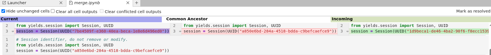

|

The conflict view is divided into four sections:

* **Top left**: your current branch.
* **Top center**: the base value from the common ancestor.
* **Top right**: the incoming branch you are merging.
* **Bottom**: the resulting cell.

Use the **arrows** to select which content to include in the result.
Manual editing of the result is also allowed.

|

Metadata follows the same rules. In general, ignore metadata changes unless you see nbdime conflict markers. Remove those entries.

.. figure:: figs/merge_conflict_metadata.png
   :width: 100%
   :align: center
   :alt: Example of conflict resolution in notebook merge

When the same cell is added twice, a conflict pane appears. In this case, two new cells replaced two existing ones. You can choose to keep all cells or discard some. When finished, click Resolve Conflict.

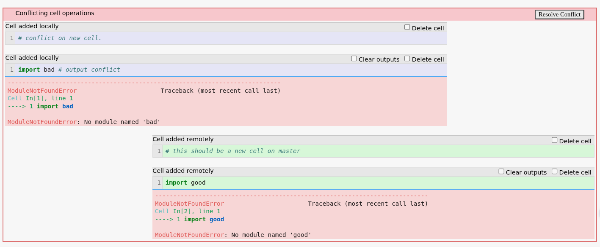

|

**Merge Guidelines**

* For the first cell, prefer the **left-hand value** (your branch) to preserve your session context.
* Ignore metadata changes unless `nbdime` flags explicit conflicts.
* When identical cells are added twice, choose which to retain or keep both.
* After all conflicts are resolved ( you may need to click the `Resolve Conflict` button), click **Mark as Resolved**.

This automatically triggers a **commit** for your branch.

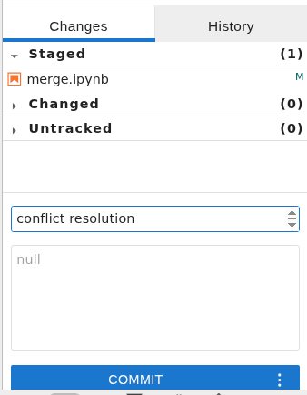

|

**After Merge**

* Push your merged branch to master so John can review and integrate it.
* The Push button initiates the action.
* Once merged, the change history of the specification reflects the full chain of commits.

|

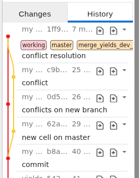

|

If unsatisfied with changes, open the **History** view and click **Rollback**.
This reverts all commits made after the selected one.

|

.. _dev_recommendations:

*****************************
Additional Recommendations
*****************************

* Avoid committing notebooks that contain **outputs**.
  Merge tools ignore outputs during conflict resolution.
* Keep the initial specification on **master**.
  Use separate branches for all development work.
* In your development branch:

  - Prefer adding new cells rather than heavily modifying existing ones.
  - This minimizes future merge conflicts.

* After development is complete, delete the forked specification if no longer needed.

|

.. index::
   %spec%: Specification Development
