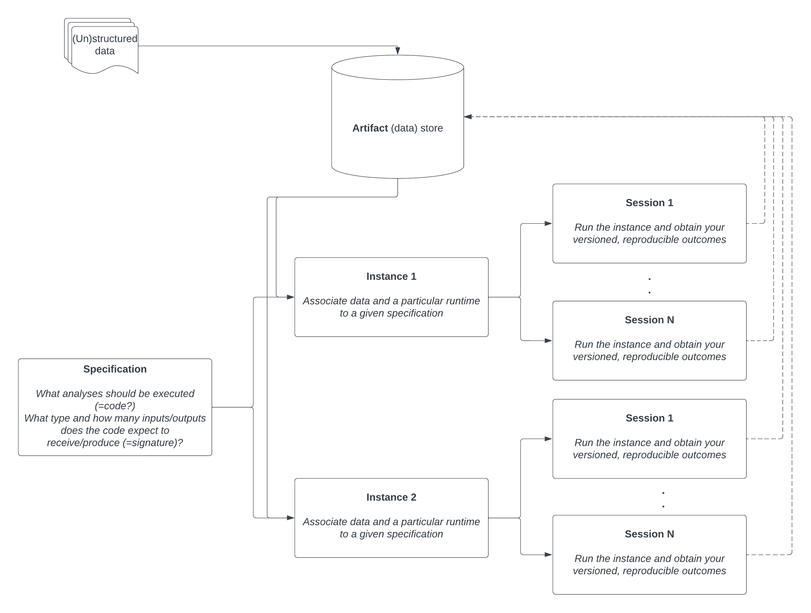

..
    label for referencing to this section

.. index::
   %model%: Create an end-to-end analysis pipeline

.. _chiron_workflow:

Workflow in Yields for Performance
##################################

*******
General
*******

The ultimate purpose for using Yields for Performance is to carry out quantitative model risk assessments and
enable monitoring of the overall model's fit-for-purpose, while ensuring reproducibility and :term:`Standardization`.

On the one hand (Jupyter) notebooks are used, that define *how* the model should be assessed (i.e. which tests). These notebooks are to be scripted by the user and depends on the particular use case (model).

On the other hand, Yields for Performance is taking care off the reproducibility, i.e. the relations between and versioning of the different :term:`Application objects` used in an testing pipeline.

In the screenshot below, we show how a model risk expert might approach a model validation when using Yields for Performance.

|

Basically, what happens is the following:

1. The user creates an :term:`Artifact` under which he can upload a datafile as an :term:`Artifact Version`.
2. The expert defines which analyses/tests he might want to run on any given (combination of) :term:`Artifact`\(s). For this
   Python notebook(s) are to be scripted  - see :ref:`specification_procedures`. To get to the satisfying result,
   some iterations might be performed such that the notebook works correctly and according to expectations.

   The specifications serve as a user-defined template that can be applied on a multitude of comparable inputs.
   For example, a model's performance might be assessed on different geographies (countries). To allow standardization and a fair comparison
   between the model's performance on these different countries, the same template will be used and executed on data containing either country 1 data or country 2 data (these correspond to the two instances in the above figure).

   Note that this concept - i.e. specification as a blue print to be applied for similar models - also paves the way to better standardization as it requires the data to be delivered in a robust and methodological manner.

3. To create tangible outputs from a specification the notebooks should be executed, which means that the specification shall be executed onto their defined inputs.
   In order to create an :term:`Instance` and run it to get your results - see :ref:`instance_procedures`.

   The output of the instance run - a so-called session - is also stored inside an artifact.

.. note::

    * The output of one instance can easily be used as input for another instance (this is where the loop closes in the figure). Indeed, because these outputs are stored inside the datalake they can also easily be retrieved from it by other specifications.
    * In case one wants to execute the pipeline on a recurrent basis, it suffices to add new data. If then all registered instances are executed one automatically gets to the model assessment report.

.. _e2e_example:

*********************************************************************
End-to-end example: basics on how to work with Yields for Performance
*********************************************************************

In this section we enable the user to start using Yields for Performance by providing a particular use case,
including the relevant datasets, jupyter notebook, readme etc. The main goal is to offer some
specific end-to-end use cases such that the user gets familiar with all steps to be taken in creating
his own model risk assessments in Yields for Performance.

In this example you will learn the most basic workflow within Yields for Performance, i.e
reading in a dataset, doing some calculations on it, and saving another dataset containing those metrics back into the artifact store.

This example teaches you:

* how to create (and run) an :term:`Artifact`, a :term:`Specification` and an :term:`Instance`.

.. figure:: figs/Validation_Binary_Light_workflow.png
    :width: 100%
    :align: center
    :alt: Yields for Performance workflow

All relevant files are stored here: :download:`click here to download<downloadable_docs/Binary_Target_Light_Assessment.zip>`.

In a separate chapter, see :ref:`use_case`, we deliver other examples that can be considered
practical use cases, being both extensions of the above E2E example, as well as more topical use cases, i.e. focused on the model risk analytics side (instead of learning how to create a basic instance).
